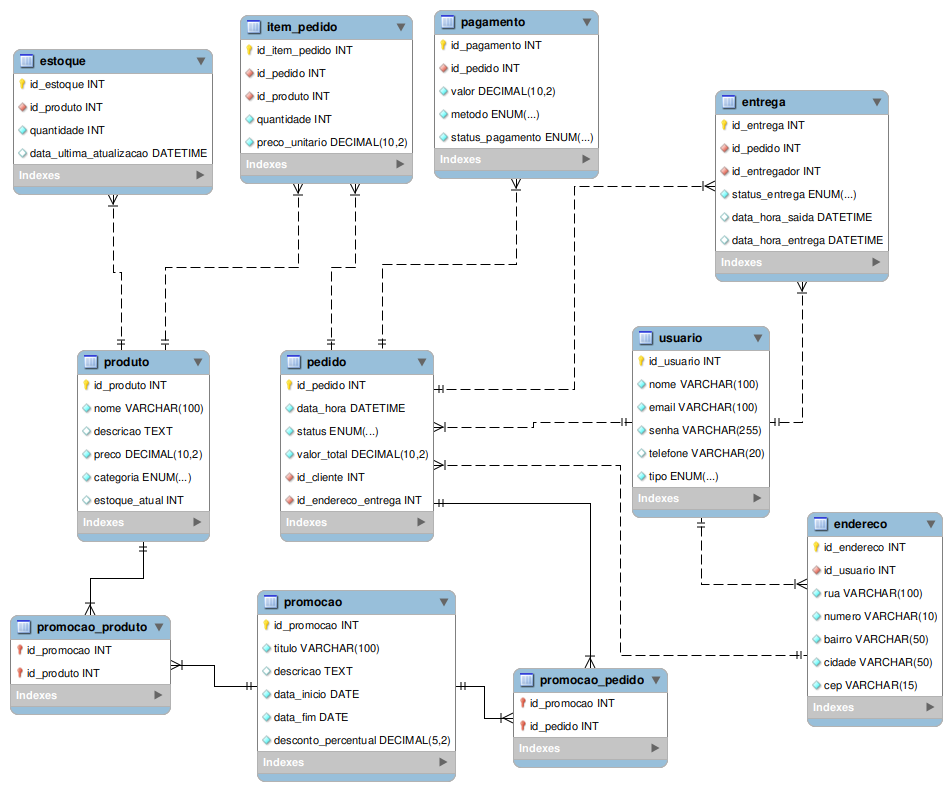

# Projeto Integrador - Sistema de Gestão para Pizzaria

_(Pizzaria Santory)_

O projeto consiste no desenvolvimento de um sistema de gestão para a Pizzaria Santory, uma empresa familiar que busca modernizar seus processos operacionais. O objetivo principal é automatizar o registro de pedidos, o controle de estoque, a gestão de entregas e a comunicação com os clientes, proporcionando maior eficiência e melhor experiência para os consumidores. A solução também incluirá funcionalidades como pagamento online, rastreamento de pedidos e ferramentas de fidelização, atendendo às necessidades específicas da pizzaria e resolvendo os problemas identificados em sua operação atual.

**IMPORTANTE**: [**Cadastre seu projeto nesse link**](https://docs.google.com/spreadsheets/d/165xR63Yy9C75saQX-I_RsZV-hTrdiToei5Ave0JU1uQ/edit?usp=sharing).

Professor: [Marco André Mendes](github.com/marcoandre)

Equipe:

- [Higor do Amaral Fritz](https://github.com/HigorAmaral)
- [Matheus Gaspar](https://github.com/Gaspatt)
- [Nicolas Sestrem](https://github.com/i-sestrem).
- [Kaue Ian Dombrovski da Cunha](https://github.com/kaue-ian)

Links do projeto:
(_Coloque aqui os links para a documentação do projeto e os repositórios e plubicação do backend e frontend._)

- [Documentação (esse documento)]()
- Backend: [Repositório](https://github.com/Santory-Pizzaria/SantoryBackEnd.git) e [Publicação]()
- Frontend: [Repositório](https://github.com/Santory-Pizzaria/SantoryFrontEnd.git) e [Publicação](https://santoryfrontend.vercel.app/)

# 1. Desenvolvimento

**1.1 Modelos de Sistemas**

**Nessa parte a equipe deve escolher um dos modelos de sistemas para desenvolver o projeto. Ao escolher, escreva uma breve descrição do sistema e o motivo da escolha e pode apagar os outros modelos.**

**1.1.1 Ponto de Vendas (PDV)**

**Gerenciamento de pedidos e entregas para uma pizzaria**

O sistema escolhido será um software de gestão para a Pizzaria Santory. O objetivo é automatizar os processos de pedidos, entregas e controle de estoque, além de oferecer opções de pagamento online e ferramentas para fidelização de clientes. A escolha foi motivada pela necessidade de resolver os problemas operacionais identificados, como atrasos, erros no registro de pedidos e falta de controle eficiente de insumos, garantindo uma melhor experiência para os clientes e maior eficiência para a empresa.

#2. Situacao Problema

**Introdução:**
A Pizzaria Santory é uma empresa familiar localizada no centro da cidade, fundada há 10 anos por João e Maria Silva. A pizzaria é conhecida pela qualidade de suas pizzas artesanais e pelo atendimento acolhedor. Atualmente, a empresa conta com 10 funcionários, incluindo pizzaiolos, atendentes e entregadores. Apesar do sucesso local, a pizzaria enfrenta desafios para atender à crescente demanda de pedidos, especialmente nos horários de pico.

**Situação-problema:**
Atualmente, a Pizzaria Santory opera de forma semi-manual. Os pedidos são recebidos por telefone ou presencialmente, o que frequentemente resulta em filas e atrasos no atendimento. Os atendentes anotam os pedidos em papel, o que pode levar a erros de comunicação entre a equipe de atendimento e a cozinha. Além disso, o controle de estoque é feito manualmente, dificultando a previsão de insumos necessários e ocasionando, por vezes, a falta de ingredientes.

O sistema de delivery também apresenta problemas. Os entregadores recebem as informações dos pedidos verbalmente ou por mensagens de texto, o que pode gerar confusões e atrasos nas entregas. Não há um sistema de rastreamento para os clientes acompanharem o status de seus pedidos, o que frequentemente resulta em reclamações.

Outro ponto crítico é a ausência de um sistema de pagamento online. Os clientes só podem pagar em dinheiro ou com cartão no momento da entrega, o que limita as opções e pode causar desconforto para alguns consumidores. Além disso, a pizzaria não possui um canal digital eficiente para divulgar promoções ou fidelizar clientes.

**Conclusão:**
Os problemas identificados, como erros no registro de pedidos, atrasos nas entregas, falta de controle de estoque e ausência de opções de pagamento online, impactam diretamente a experiência do cliente e a eficiência operacional da pizzaria. Um software integrado poderia resolver esses problemas ao automatizar o registro de pedidos, implementar um sistema de rastreamento de entregas, gerenciar o estoque em tempo real e oferecer opções de pagamento online, além de criar um canal digital para promoções e fidelização de clientes.

# 3. Descrição da proposta

O software proposto para a Pizzaria Santory será uma plataforma integrada que automatizará os processos de pedidos, entregas e gestão interna. O objetivo principal é melhorar a eficiência operacional e a experiência do cliente. A seguir, destacam-se os principais pontos da solução:

- **Foco de ação do software:** O sistema permitirá o registro de pedidos online e presencial, o acompanhamento em tempo real do status dos pedidos, o gerenciamento de entregas e o controle automatizado de estoque. Além disso, oferecerá opções de pagamento online e ferramentas para divulgação de promoções e fidelização de clientes.

- **Níveis de usuário do sistema:**

  - **Administrador:** Terá acesso completo ao sistema, podendo gerenciar pedidos, estoque, entregas, promoções e relatórios.
  - **Funcionários:** Divididos em atendentes, pizzaiolos e entregadores, cada grupo terá acesso restrito às funcionalidades relacionadas às suas funções específicas.
  - **Clientes:** Poderão realizar pedidos, acompanhar o status das entregas e acessar promoções.

- **Funcionalidades principais:**
  - Registro de pedidos online e presencial.
  - Rastreamento de entregas em tempo real.
  - Controle automatizado de estoque com alertas de reposição.
  - Integração com sistemas de pagamento online.
  - Ferramentas para criação e divulgação de promoções.
  - Relatórios gerenciais para análise de desempenho.

Com essa solução, a Pizzaria Santory poderá reduzir erros operacionais, melhorar a comunicação interna, aumentar a satisfação dos clientes e otimizar a gestão do negócio.

# 4. Modelagem de Dados

A modelagem de dados do sistema da Pizzaria Santory foi elaborada para garantir o controle eficiente dos pedidos, estoque, entregas, promoções e usuários. Abaixo estão descritas as principais entidades, seus atributos e os relacionamentos entre elas.

## 4.1 Entidades Principais

- **Usuário**
  - id_usuario (PK)
  - nome
  - email
  - senha
  - telefone
  - tipo (administrador, atendente, pizzaiolo, entregador, cliente)

- **Pedido**
  - id_pedido (PK)
  - data_hora
  - status (em preparo, em entrega, entregue, cancelado)
  - valor_total
  - id_cliente (FK)
  - id_endereco_entrega (FK)

- **ItemPedido**
  - id_item_pedido (PK)
  - id_pedido (FK)
  - id_produto (FK)
  - quantidade
  - preco_unitario

- **Produto**
  - id_produto (PK)
  - nome
  - descricao
  - preco
  - categoria (pizza, bebida, sobremesa, etc.)
  - estoque_atual

- **Estoque**
  - id_estoque (PK)
  - id_produto (FK)
  - quantidade
  - data_ultima_atualizacao

- **Entrega**
  - id_entrega (PK)
  - id_pedido (FK)
  - id_entregador (FK)
  - status_entrega (pendente, em rota, entregue)
  - data_hora_saida
  - data_hora_entrega

- **Promoção**
  - id_promocao (PK)
  - titulo
  - descricao
  - data_inicio
  - data_fim
  - desconto_percentual

- **Pagamento**
  - id_pagamento (PK)
  - id_pedido (FK)
  - valor
  - metodo (dinheiro, cartão, online)
  - status_pagamento (pendente, aprovado, recusado)

- **Endereço**
  - id_endereco (PK)
  - id_usuario (FK)
  - rua
  - numero
  - bairro
  - cidade
  - cep

## 4.2 Relacionamentos

- Um **Usuário** pode ser cliente, funcionário ou administrador.
- Um **Cliente** pode ter vários **Pedidos**.
- Cada **Pedido** pode conter vários **ItensPedido**.
- Cada **ItemPedido** está relacionado a um **Produto**.
- O **Estoque** controla a quantidade de cada **Produto**.
- Cada **Pedido** pode gerar uma **Entrega**, realizada por um **Entregador** (Usuário).
- **Promoções** podem ser aplicadas a **Pedidos** ou **Produtos**.
- Cada **Pedido** possui um **Pagamento** associado.
- **Endereços** são cadastrados pelos usuários para entrega.

## 4.3 Diagrama Entidade-Relacionamento (DER)

Essa modelagem garante a rastreabilidade dos pedidos, controle de estoque, gestão de entregas e promoções, além de permitir a expansão para novas funcionalidades no futuro.

# 4. Regras de negócio

RN01: Um pedido pode ser registrado através da plataforma online ou diretamente no ponto de venda (presencial/telefone(site).

RN02: O status de um pedido deve ser atualizado em tempo real e visível para o cliente e funcionários relevantes.

RN03: O controle de ingredientes em estoque deve ser automatizado, com baixas conforme os pedidos são preparados.

RN04: O sistema deve gerar alertas para o administrador quando o estoque atingir um limite mínimo.

RN05: O sistema deve suportar pagamentos online através de métodos seguros.

RN06: Pagamentos na entrega devem ser registrados no sistema pelo entregador ou atendente.

RN07: Clientes cadastrados devem poder rastrear o status de seus pedidos.

RN08: O administrador deve poder criar, gerenciar e divulgar promoções e ofertas.

RN09: O sistema deve gerar relatórios gerenciais para análise de vendas, estoque e desempenho.

RN10: O sistema deve ter três níveis de acesso: Administrador, Funcionário e Cliente.

RN11: O Administrador tem acesso irrestrito ao sistema.

RN12: Funcionários têm acesso limitado às suas responsabilidades.

RN13: Clientes podem realizar e acompanhar pedidos, visualizar histórico e acessar promoções.

RN14: O registro manual de pedidos em papel deve ser substituído pelo sistema digital.

RN15: A comunicação entre atendimento e cozinha deve ocorrer via sistema.

RN16: Informações de entrega devem ser fornecidas aos entregadores via sistema.

RN17: O sistema deve prover um canal digital para comunicação e fidelização de clientes.

RN18: Um pedido só pode ser cancelado antes de iniciar o preparo.

RN19: Cada item do cardápio deve ter preço definido e associação com ingredientes.

RN20: Promoções podem ter validade e condições específicas.

# 5. Requisitos funcionais

RF01: Permitir pedidos online por clientes cadastrados ou não.

RF02: Permitir registro de pedidos por telefone ou presencialmente.

RF03: Exibir cardápio completo com descrições, tamanhos e preços.

RF04: Permitir personalização de itens (ingredientes, massa, observações).

RF05: Calcular automaticamente o valor total do pedido.

RF06: Permitir escolha da forma de pagamento.

RF07: Enviar notificação de confirmação do pedido.

RF08: Interface para cozinha visualizar pedidos pendentes.

RF09: Permitir que a cozinha atualize o status do pedido.

RF10: Permitir cancelamento de pedidos conforme a RN18.

RF11: Registrar o horário de cada etapa do pedido.

RF12: Atribuir pedidos a entregadores disponíveis.

RF13: Fornecer detalhes do pedido aos entregadores.

RF14: Sugerir rotas otimizadas (opcional).

RF15: Atualizar status da entrega pelo entregador.

RF16: Permitir rastreio do pedido em tempo real pelo cliente.

RF17: Cadastrar ingredientes com unidade e quantidade inicial.

RF18: Deduzir estoque com base nos pedidos preparados.

RF19: Alertas automáticos ao atingir estoque mínimo.

RF20: Registrar entrada de ingredientes manualmente.

RF21: Gerar relatórios de movimentação de estoque.

RF22: Integrar com gateways de pagamento online.

RF23: Registrar pagamentos na entrega.

RF24: Gerar comprovantes de pagamento para clientes.

RF25: Cadastro de clientes com dados e histórico de pedidos.

RF26: Visualização do histórico de pedidos pelos clientes.

RF27: Criação e gestão de promoções pelo administrador.

RF28: Divulgação de promoções ativas na plataforma.

RF29: Sistema de pontos de fidelidade (opcional).

RF30: Cadastro e gerenciamento de usuários do sistema.

RF31: Definir níveis de permissão para usuários.

RF32: Configurar informações gerais da pizzaria.

RF33: Cadastrar e gerenciar itens do cardápio.

RF34: Gerar relatórios gerenciais diversos.

RF35: Interface para atendentes gerenciarem pedidos e clientes.

RF36: Interface para pizzaiolos acompanharem a fila de pedidos.

RF37: Interface mobile para entregadores atualizarem entregas e pagamentos.

# 6. Requisitos não funcionais

RNF01: Tempo de resposta rápido, mesmo em horários de pico.

RNF02: Suporte a grande volume de pedidos simultâneos.

RNF03: Baixa latência na atualização de status e rastreamento.

RNF04: Dados sensíveis devem ser criptografados.

RNF05: Autenticação forte e controle de acesso por papéis.

RNF06: Conformidade com leis de proteção de dados (ex: LGPD).

RNF07: Proteção contra vulnerabilidades web.

RNF08: Backups automáticos e regulares do banco de dados.

RNF09: Interface intuitiva e clara para todos os perfis.

RNF10: Processo de pedido online simples e direto.

RNF11: Feedback claro ao usuário sobre ações.

RNF12: Interface responsiva para diferentes dispositivos.

RNF13: Documentação e tutoriais disponíveis, se necessário.

RNF14: Alta disponibilidade no horário de funcionamento.

RNF15: Sistema robusto e de rápida recuperação.

RNF16: Controle de estoque preciso.

RNF17: Código bem estruturado, modular e documentado.

RNF18: Escalabilidade para mais usuários e pedidos.

RNF19: Facilidade de atualização de cardápio e promoções.

RNF20: Integração segura com gateways de pagamento.

RNF21: Integrações futuras com outros serviços.

RNF22: Compatibilidade com navegadores modernos.

# 7. Diagrama de Caso de Uso

**7.1 Introdução**

O diagrama de caso de uso é uma ferramenta de modelagem que descreve o comportamento de um sistema a partir da perspectiva do usuário. Ele é usado para capturar os requisitos funcionais de um sistema.

- Especificam a visão externa do sistema.
- Descrevem como o sistema é percebido por seus usuários.
- Descrevem as interações entre os usuários e o sistema.

**Os casos de uso:**

- Descrevem como os **usuários interagem com o sistema** (as funcionalidades do sistema)
- Facilitam a **organização dos requisitos** de um sistema.
- Dão uma **visão externa** do sistema
- O conjunto de casos de uso deve ser capaz de comunicar a **funcionalidade** e o **comportamento** do sistema para o cliente.
- Descrevem **o que** o sistema faz, mas **não** especificam **como** isso deve ser feito.

**7.2 Elementos do diagrama de caso de uso**

7.2.1 **Atores**

- Representam os papéis desempenhados por **elementos externos** ao sistema
  - Ex: humano (usuário), dispositivo de hardware ou outro sistema (cliente)
- Elementos que **interagem** com o sistema

Notação:

**Exemplo: Loja de CDs**

**Identificando os atores**

- Uma loja de CDs possui discos para venda. Um cliente pode comprar uma quantidade ilimitada de discos para isto ele deve se dirigir à loja.
- A loja possui um **atendente** cuja função é atender os clientes durante a venda dos discos. A loja também possui um **gerente** cuja função é administrar o estoque para que não faltem discos. Além disso é ele quem dá folga ao atendente, ou seja, ele também atende os clientes durante a venda dos discos.

**E o cliente?**

- Não é ator pois ele **não interage** com o sistema!

**7.2.2 Casos de uso**

- Representam **funcionalidades** do sistema (requisitos funcionais).
- São iniciados por **atores** ou por outros casos de uso.

> **Dica**: nomeie os casos de uso com **verbos** no **infinitivo**.

Notação:

**Exemplo: Loja de CDs**

**Identificando os casos de uso**

- Uma loja de CDs possui discos para venda. Um cliente pode comprar uma quantidade ilimitada de discos para isto ele deve se dirigir à loja. A loja possui um atendente cuja função é atender os clientes durante a **venda dos discos**.
- A loja também possui um gerente cuja função é **administrar o estoque** para que não faltem discos. Além disso é ele quem dá folga ao atendente, ou seja, ele também atende os clientes durante a **venda dos discos**.

**7.2.3 Relacionamentos**

**7.2.3.1 Relacionamento de associação**

- Indica que um ator **participa** de um caso de uso, ou seja, o ator **interage** (comunica-se) com o caso de uso.
- É representado por uma **linha sólida**.
- Um ator pode se relacionar com **um ou mais casos de uso**.

> Dicas:
>
> - Não use setas nas linhas de associação.
> - Associações não representam fluxo de informação.

**Exemplo: Loja de CDs**

**Identificando os relacionamentos de associação**

- Uma loja de CDs possui discos para venda. Um cliente pode comprar uma quantidade ilimitada de discos para isto ele deve se dirigir à loja. A loja possui um _atendente_ cuja função é atender os clientes durante a **venda dos discos**.
- A loja também possui um _gerente_ cuja função é **administrar o estoque** para que não faltem discos. Além disso é ele quem dá folga ao _atendente_, ou seja, ele também atende os clientes durante a **venda dos discos**.

**7.2.3.2 Relacionamento de generalização/especialização**

**Generalização de atores**

- Quando dois ou mais atores podem se **comunicar com o mesmo conjunto de casos de uso**.
- Indica que um ator **herda** as características de outro ator.
  – Um filho (herdeiro) pode se comunicar com todos os casos de uso que seu pai se comunica.

> **Dica:** coloque os herdeiros **embaixo**.

**Notação:**

**Exemplo: Loja de CDs**

**Identificando os relacionamentos de generalização/especialização de atores**

**Generalização de casos de uso**

– O caso de uso filho herda o comportamento e o significado do caso de uso pai.
– O caso de uso filho pode incluir ou sobrescrever o comportamento do caso de uso pai.
– O caso de uso filho pode substituir o caso de uso pai em qualquer lugar que ele apareça.

> **Dica:** deve ser aplicada quando uma condição resulta na definição de
> diversos fluxos alternativos.

Notação:

**Exemplo: Loja de CDs**

**Identificando os relacionamentos de generalização/especialização de casos de uso**

**Novos requisitos:**

- As vendas podem ser **à vista** ou **a prazo**. Em ambos os casos o estoque é
  atualizado e uma nota fiscal, entregue ao consumidor.
- No caso de uma **venda à vista**, clientes cadastrados na loja e que compram mais de 5 CDs de uma só vez ganham um desconto de 1% para cada ano de cadastro.
- No caso de uma **venda a prazo**, ela pode ser parcelada em 2 pagamentos com um
  acréscimo de 20%. As vendas a prazo podem ser pagas no **cartão** ou no **boleto**.
  - Para pagamento com **boleto**, são gerados boletos bancários que são entregues ao cliente e armazenados no sistema para lançamento posterior no caixa.
  - Para pagamento com **cartão**, os clientes com mais de 10 anos de cadastro na loja ganham o mesmo desconto das compras à vista.

**Identificando mais relacionamentos de generalização/especialização de casos de uso**

**7.2.3.3 Relacionamento de dependência**

**Extensão**

- Representa uma variação/extensão do comportamento do caso de uso base.
- O caso de uso estendido só é executado sob certas circunstâncias.
- Separa partes obrigatórias de partes opcionais.
  - Partes obrigatórias: caso de uso base.
  - Partes opcionais: caso de uso estendido.
- Fatorar comportamentos variantes do sistema (podendo reusar este comportamento
  em outros casos de uso).

**Notação:**

 - notação")

**Exemplo: Loja de CDs**

**Identificando os relacionamentos de dependência (extensão)**

**Novos requisitos:**

- No caso de uma venda à vista, clientes cadastrados na loja e que compram mais
  de 5 CDs de uma só vez ganham um **desconto** de 1% para cada ano de cadastro.
- No caso de uma venda a prazo...
  - ...Para pagamento com cartão, os clientes com mais de 10 anos de cadastro na loja ganham o mesmo **desconto** das compras à vista.

")

**Inclusão**

- Evita repetição ao fatorar uma atividade
  comum a dois ou mais casos de uso.
- Um caso de uso pode incluir vários casos de uso.

**Notação:**

 - notação")

**Exemplo: Loja de CDs**

**Novos requisitos:**
Para efetuar vendas ou administrar estoque, atendentes e gerentes terão que **validar** suas respectivas senhas de
acesso ao sistema.

")

**7.2.4 Fronteira do sistema**

- Elemento opcional (mas essencial para um bom
  entendimento).
- Serve para definir a área de atuação do sistema, ou seja, seus limites.

**Identificando a fronteira do sistema**

---
